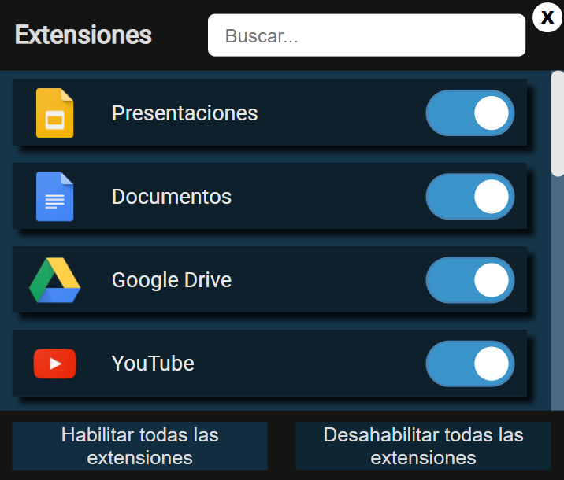

# Administrador-de-Extensiones
Una extension de Chrome que facilita habilitar y deshabilitar las extensiones instaladas.

Documentación:
* [Chrome Documentation](https://developer.chrome.com/extensions/management "The chrome.management API")
* [TypeScript Documentation](https://www.typescriptlang.org/docs/ "TypeScript")
* [Grid Layout MDN](https://developer.mozilla.org/es/docs/Web/CSS/CSS_Grid_Layout "CSS")
___
## Actualización
Ahora se puede usar por medio del teclado

Si el icono de extensión 

está a la derecha de la barra de herramientas de Chrome

Pasos:
1. Presionar f10
2. Posicionar el foco en el administrador 
3. Presionar enter  

Si no está en la barra, debe haber una en ella llamada Extensiones, solo debes fijar el Administrador y seguir los anteriores pasos   
### Screenshots
El botón de una extensión activa

Cuando está desactivada

Así lucen los botones generales

