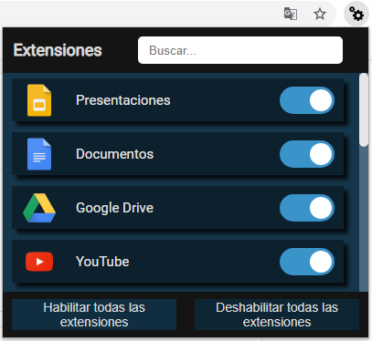

# Administrador-de-Extensiones
Al hacer click en el icono tienes la posibilidad de activar/desactivar las extensiones

Documentation:

* [Chrome documentation](https://developer.chrome.com/extensions/management "The chrome.management API")
* [Grid Layout](https://developer.mozilla.org/es/docs/Web/CSS/CSS_Grid_Layout "Css")